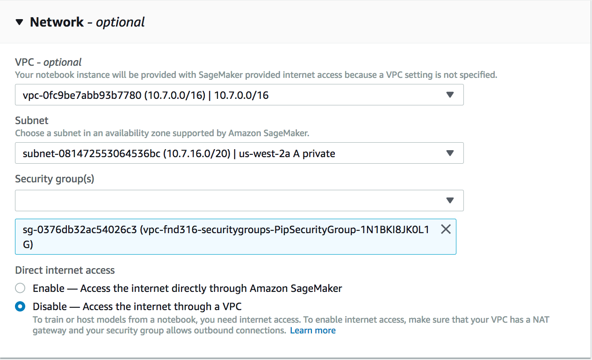

# Introduction

In this workshop, we discuss some of the capabilities and controls provided by Amazon SageMaker, AWS fully managed platform for machine learning, to secure and monitor pre-built Jupyter Notebook instances and Training jobs instances. This list is very exhaustive, and what we will discuss today is a subset of controls that are made available by Amazon SageMaker.

Amazon SageMaker is a machine learning platform for Developers and Data Scientists. Amazon SageMaker takes undifferentiated heavy lifting involved in Machine Learning process and allows developers and data scientists to focus on solving a business problem by following a build, train, and deploy pattern.

Amazon SageMaker simplifies the management of ML infrastructure and gives data scientist and developers an almost serverless experience. However, CloudOps and SecurityOps teams in an organization can centrally configure, control, and monitor traffic ingress and egress to build and train instances of Amazon SageMaker.

Amazon SageMaker encrypts most of the connection by default. But, there are specific parts of machine learning within Amazon SageMaker platform where encryption of channel and encryption of attached EBS volume is left to the discretion of an organization to make a tradeoff between performance and security.

## Learning Objectives
1. How to connect Amazon SageMaker Jupyter Notebooks to your VPC and Subnet
2. How to apply Security Groups to Amazon SageMaker Jupyter Notebooks
3. How to disable Internet Access
4. **(Feature Callout)**How to disable Root Access on Amazon SageMaker Jupyter Notebooks
5. **(Reference Material Provided)**How to encrypt EBS volume attached to your Amazon SageMaker Jupyter Notebooks
6. How to setup NAT Gateway for secure ML libraries download from the Internet
7. How to use AWS Backbone for secure access to data sitting in Amazon S3
8. **(Script Provided)**How to connect your Amazon SageMaker training jobs to your VPC
9. **(Script Provided)**How to apply Security Groups to Amazon SageMaker training jobs instances
10. **(Script Provided)**How to encrypt the connection between Amazon SageMaker Training Instances

### Prerequisites and assumptions
1. To complete this lab, you need a personal Laptop and an AWS account that provides access to AWS services. You should have Admin access as we will be creating new roles and policies to configure the lab environment.
2. The labs in the workshop are sequential. Please continue in the order specified.
3. Please sign in to AWS Console with your credentials and select a region to work. 
4. Select your AWS region(top right corner of AWS Console) - I would prefer you to work with either of N. Virginia, Oregon or Ohio. 

## **Lab 1 - Setup VPC and Subnet for Amazon SageMaker**
A VPC is a virtual network inside AWS where you can isolate your setup using private IP addresses. A VPC consists of several subnets, and each subnet is bound to an Availability Zone. A public subnet has a direct route to the Internet. As long as your EC2 instances have a public IP, they can communicate (in and out) with the Internet. A private subnet does not have a route to the Internet. You cannot access instances in private subnet from the Internet.

### Installation Steps
1. Click the below Launch Stack Icon to install  VPC and Subnet in your AWS Account  <a target="_blank" href="https://console.aws.amazon.com/cloudformation/home?region=us-east-1#/stacks/new?stackName=vpc-fnd316&templateURL=https://s3-eu-west-1.amazonaws.com/widdix-aws-cf-templates-releases-eu-west-1/v3.3.0/vpc/vpc-2azs.yaml"></a>
2. Click Next to proceed with the next step of the wizard.
3. Specify a name and all parameters for the stack. For ClassB input any number between 0-255.
4. Click Next to proceed with the next step of the wizard.
5. Click Next to skip the Options step of the wizard.
6. Click Create to start the creation of the stack.
7. Wait until the stack reaches the state CREATE_COMPLETE
8. Select the 'vpc-fnd316' stack and copy the VPCID and SubnetIds from Output Tab. We will use it later when we configure Notebook and Training jobs
8. Following setup will be created in your AWS Account 

## **Lab 2 - Install a NAT Gateway in your above VPC**
If you want to access the Internet from a private subnet, you have to create a NAT gateway.

### Installation Steps
1. Click the below Launch Stack Icon to install  VPC and Subnet in your AWS Account  <a target="_blank" href="https://console.aws.amazon.com/cloudformation/home?region=us-east-1#/stacks/new?stackName=vpc-fnd316-nat-gateway&templateURL=https://s3-eu-west-1.amazonaws.com/widdix-aws-cf-templates-releases-eu-west-1/v3.3.0/vpc/vpc-nat-gateway.yaml"></a>
2. Click Next to proceed with the next step of the wizard.
3. Specify a name and all parameters for the stack. For ParentVPCStack, input 'vpc-fnd316'
4. Click Next to proceed with the next step of the wizard.
5. Click Next to skip the Options step of the wizard.
6. Click Create to start the creation of the stack.
7. Wait until the stack reaches the state CREATE_COMPLETE
8. Following setup will be created in your AWS Account 

## **Lab 3 - Install VPC Endpoint to S3**
Use VPC endpoint to securely route traffic within a VPC for private instances(Amazon SageMaker Notebook Instance and Training Instance) to access S3 without the need of a NAT Gateway, NAT instance, or public internet. 

### Installation Steps
1. Click the below Launch Stack Icon to install  VPC and Subnet in your AWS Account  <a target="_blank" href="https://console.aws.amazon.com/cloudformation/home?region=us-east-1#/stacks/new?stackName=vpc-fnd316-s3endpoint&templateURL=https://s3-eu-west-1.amazonaws.com/widdix-aws-cf-templates-releases-eu-west-1/v3.3.0/vpc/vpc-endpoint-s3.yaml"></a>
2. Click Next to proceed with the next step of the wizard.
3. Specify a name and all parameters for the stack. For ParentVPCStack, input 'vpc-fnd316'
4. Click Next to proceed with the next step of the wizard.
5. Click Next to skip the Options step of the wizard.
6. Click Create to start the creation of the stack.
Wait until the stack reaches the state CREATE_COMPLETE
7. Following setup will be created in your AWS Account 

## **Lab 4 - Install VPC Flow Logs to CloudWatch Logs**
Flow Logs contain aggregated network traffic data in your VPC. 

### Installation Steps
1. Click the below Launch Stack Icon to install  VPC and Subnet in your AWS Account  <a target="_blank" href="https://console.aws.amazon.com/cloudformation/home?region=us-east-1#/stacks/new?stackName=vpc-fnd316-flowlogs&templateURL=https://s3-eu-west-1.amazonaws.com/widdix-aws-cf-templates-releases-eu-west-1/v3.3.0/vpc/vpc-flow-logs.yaml"></a>
2. Click Next to proceed with the next step of the wizard. For ParentVPCStack, input 'vpc-fnd316'
3. Specify a name and all parameters for the stack. ParentVPCStack="vpc-fnd316", retentiondays =1, TrafficType=ALL
4. Click Next to proceed with the next step of the wizard.
5. Click Next to skip the Options step of the wizard.
6. Check the "I acknowledge that this template might cause AWS CloudFormation to create IAM resources". Checkbox it.
7. Click Create to start the creation of the stack.
8. Wait until the stack reaches the state CREATE_COMPLETE

Flow Logs will show up in CloudWatch Logs a few minutes after activation. 

## **Lab 5 - Install VPC Security Groups**
Security Group allows you to whitelist Inbound and Outbound Trafiic to Amazon SageMaker Jupyter Notebook Instances and Training jobs 

### Installation Steps
1. Click the below Launch Stack Icon to install VPC Security Groups in your AWS Account  <a target="_blank" href="https://console.aws.amazon.com/cloudformation/home?region=us-east-1#/stacks/new?stackName=vpc-fnd316-securitygroups&templateURL=https://awsvik-sagemaker-security.s3.amazonaws.com/vpc-sagemaker-sgs.yaml"></a>
2. Click Next to proceed with the next step of the wizard.
3. Specify a name and all parameters for the stack. For ParentVPCStack, input 'vpc-fnd316'
4. Click Next to proceed with the next step of the wizard.
5. Click Next to skip the Options step of the wizard.
6. Check the "I acknowledge that this template might cause AWS CloudFormation to create IAM resources". Checkbox it.
7. Click Create to start the creation of the stack.
8. Wait until the stack reaches the state CREATE_COMPLETE

Flow Logs will show up in CloudWatch Logs a few minutes after activation.

## **Lab 6 - Create Notebook Instance**
1. In the AWS Console, click on 'Services' on the top left side.
2. In the 'Find a service by name' search for Amazon SageMaker and click on Amazon SageMaker in the list.
3. From the left side Amazon SageMaker console, select Notebook instances
4. Click 'Create Notebook Instance' button on the top right-hand side.
5. Fill out the details to configure the Jupyter Notebook correctly
6. Complete Instance settings
7. Select and click 'Create a new role'
8. Select 'Any S3 buckets' for permissions and click 'Create role'
9. We will leave the entry for encryption default. In case you are interested in learning more about how to set up and manage encryption centrally at scale on Amazon SageMaker EBS volume. Click <a target="_blank" href="https://aws.amazon.com/blogs/mt/enable-self-service-secured-data-science-using-amazon-sagemaker-notebooks-and-aws-service-catalog/"></a> to refer a detailed blog on this subject.
10. Configure network, select VPC, Subnet, Security Group. The VPCID should be the one that was created in Lab 1(10.(the class B Number you enetered in Lab 1).0.0. The Subnet can be anyone in the dropdown that says "A private" and the security group should be one with the "pipsecuritygroup"

11. Scroll down to the bottom of the page and click 'Create Notebook Instance' in the bottom right.
12. Wait for the status of your Notebook Instance to become 'In service'. Once the status is 'In service', click 'Open Jupyter' next to the 'In Service' status under 'Action' field. This will open up the Jupyter Notebook in your browser. Jupyter Notebook is the IDE that data scientists uses to script machine leanring jobs.
13. In the Jupyter Notebook, Click 'New' on the right-hand side.

14. In the dropdown menu under 'New', scroll to the bottom and click 'Terminal'. This will open up terminal window in your browser and you can use it to run cli commands on your Notebook instance.

## **Lab 7 - Let's fire some commands, understand and validate the traffic flow**
1. Developing in Python requires another software package, called Development Tools. Let's install this package by entering **sudo yum groupinstall “Development Tools”**.
2. The picture below explains the traffic flow from SageMaker Notebook to Intenet detailing how "Development Tools" packages are downloaded 

3. You can monitor your traffic from CloudWatch. For command that we just fired. You will see an entry with 443 port.

**VPCLogs Fields:** [version, accountid, interfaceid, srcaddr, dstaddr, srcport, dstport, protocol, packets, bytes, start, end, action, logstatus]

 **Example Log Record:**386258261521 eni-0f0ee212d55600e7a 71.6.233.226 10.1.9.70 443 443 6 1 40 1560793217 1560793226 ACCEPT OK
 
 
  
4. Amazon SageMaker uses Amazon S3 to download training data for model training. Let's try to download the sample data for movielens from Amazon S3 into SageMaker Jupyter Instance. Run **aws s3 cp s3://awsvik-sagemaker-security/ml-latest-small.zip** to download movielens data from Amazon S3 bucket.
5. The picture below explains the traffic flow from SageMaker Notebook to Amazon S3 vis AWS Backbone
6. The **aws s3 cp** command originates from Amazon SageMaker Notebook Instance terminal window. The command traverses through to the Amazon SageMaker Notebook Instance ENI attached to a private subnet of a VPC. The subnet has a routing to redirect command over the AWS Backbone to access Amazon S3 as a target. The VPC Endpoint to Amazon S3 connection uses AWS Backbone and doesn't go over the Internet. 
7. We won't be able to cover learning objectives 8.9,10 in a compressed 1 hr schedule. But, we can use the same networking construct that we created above for Amazon SageMaker Jupyter Notebook Instance and pass it as a parameter in the fit API/Training API/Hyperparameter tuning API call. Simply pass a **VPCConfig** as a parameter in the API call.

8. In addition, to make the training more secure you can optionally encrypt the traffic between Amazon SageMaker Instances used for training. All you have to do is create a training SecurityGroup with Inbound and Outbound rules as described in the picture above and set the **EnableInterContainerTrafficEncryption** parameter to **True** in the training API call. The VPCFlowLogs will send the traffic data to AWS CloudWatch and you can use that for monitoring ingress/egress traffic just like you did for Amazon SageMaker Notebook Instances. The below picture explains the setup for training on multiple instances with inter container encryption turned ON.

## Finish the Lab
1. **Congratulations!** you have finished all the labs. Please make sure to delete all resources as noted in the section below.

## Cleanup Resources
1. Navigate to Amazon SageMaker Service Console. Stop the 'fnd316' Amazon SageMaker Notebook Instance. Once the Notebook Instance display status as stopped, go ahead and delete the amazon SageMaker Notebook Instance as shown in the picture below.
. If Amazon SageMaker Instance is not completely stopped, the delete option will be grayed out.
2. Navigate to the CloudFormation Service in the AWS Console. On AWS CloudFormation Console, note the 5 stacks that you installed in Lab 1- Lab 5. If you have not changed the naming convention much, you sould see the stack name as "VPC-FND316-XXXXXXXXX". We have to delete each one one by one sequenctailly. **Start from top-down as shown in picture below**. 
